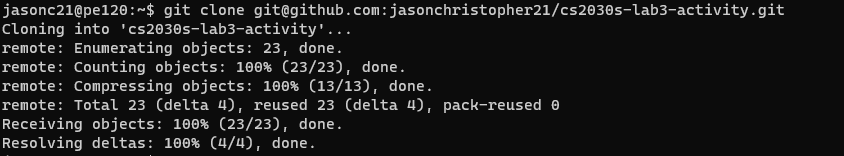

# Lab 3 Activity
_Questions are courtesy of NUS CS2030S AY22/23 Semester 2 Teaching Team_

## (0) Make a copy of this repository

To work on the files for this activity, you may want to clone this repository so that you can directly modify the code here.

### Cloning a copy to the PE nodes

The first (and recommended) way is to clone all the files into your PE node.

1. Access your PE node normally, i.e. perform `ssh` as per the usual
2. In the root directory, run the following command
```
:~$   git clone git@github.com:jasonchristopher21/cs2030s-lab3-activity.git
```

3. Your files are now stored in a directory called `cs2030s-lab3-activity`. Perform 
```
cd cs2030s-lab3-activity
```
to access the directory, and you are good to go!

### Cloning a copy locally

If you prefer to work on the files in your local machine (e.g. if you want to use VS Code or IntelliJ)

1. Ensure that you have installed Git on your computer
2. Obtain the https clone link from this repository

3. Run the following command in your terminal
```
git clone https://github.com/jasonchristopher21/cs2030s-lab3-activity.git
```
4. Your files are now stored in a directory called `cs2030s-lab3-activity`. You are good to go!

### Worst option

Copy all files manually with Ctrl-C and Ctrl-V. :O

## (1) Exercise in Exceptions

### 1A. Does this compile? - Open File with Scanner

Look at the following code found in the `1A` folder in this repository. Does the code compile?
If it does, why? If it doesn't, can you fix the code?

`1A/ExceptionDemo.java`

```java
import java.io.File;
import java.util.Scanner;

class ExceptionDemo {
  public static void main(String[] args) {
	File f = new File("hello.txt");
	Scanner s = new Scanner(f);
  }
}
```

Hint: [Java's Scanner Documentation](https://docs.oracle.com/javase/7/docs/api/java/util/Scanner.html#Scanner(java.io.File))

### 1B. Does this compile? - Open File from Another Method

How about this code, does it compile? If it does, why? If it doesn't, can you fix the code?

`1B/ExceptionDemo.java`

```java
import java.io.File;
import java.util.Scanner;

class ExceptionDemo {
  public static Scanner openFile(String filename) {
    File f = new File(filename);
    return new Scanner(f);
  }
  public static void main(String[] args) {
    Scanner sc = openFile("hello.txt");
  }
}
```

### 1C. Writing Exceptions

Create your own exception called `MyOwnException` and throw it in the class called `ExceptionDemo.java` present in directory 1C.

## (2) Exercise in Generics

### 2A. Back to Square&lt;One&gt;

Let us get our hands on with a very "generic" introduction. Declare a generic class with type parameter T and a single private field x of type T.

### 2B. Objects of your generic class

Instantiate an instance of your generic class with type argument `Integer`.

### 2C. Know your A B C

Declare a generic class `B<T>` that extends from your generic class.

Also declare a generic class `C<T>` that contains a field of the same type as your generic class in 2A. 

Are the occurences of `T` refer to the same `T`?

### 2D. Does it compile? Generics

Does the following code compile?

`2D/F.java`

```java
class F extends A<T> {

}
```

### 2E. Generic Methods

Write a generic method that copy from one array to another. Here's a skeleton:

`2E/Skeleton.java`

```java
class Skeleton { 
 public static ??? void copy(???  from, ??? to) {
   for (int i = 0; i < from.length; i++) {
	 to[i] = from[i];
   }
 }
}
```

Here is how the generic method is supposed to work

```java
String s[] = new String[2];
String t[] = new String[2];
Integer i[] = new Integer[2];
Integer j[] = new Integer[2];

Skeleton.<String>copy(s, t); // ok
Skeleton.<Integer>copy(i, j); // ok
Skeleton.<String>copy(i, j); // error
Skeleton.<String>copy(s, j); // error
```

### 2F. Generic Arrays

Write a generic class `D<T>` that contains a filed that is an array of type `T` with 10 elements. Instantiate the array in the constructor.

### 2G. Comparable Classes

Write a generic class `E<T extends Comparable<T>>` that contains a field that is an array of type T with 10 elements. Instantiate that array in the constructor.